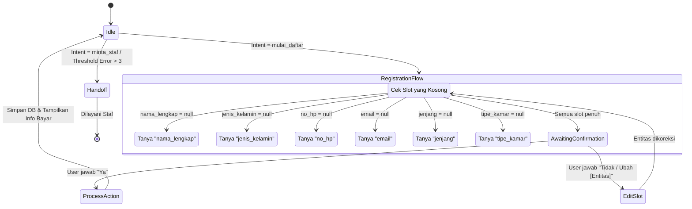

# Ringkasan Desain Arsitektur & Mesin Dialog Chatbot (Bahan Skripsi)

## 1. Pemilihan Algoritma NLU (Intent Classification)

Dalam pengembangan NLU (Natural Language Understanding) untuk klasifikasi intent, terdapat dua pendekatan utama yang dipertimbangkan:

1.  **Pendekatan Internal Laravel (PHP-ML): TF-IDF + Naive Bayes / LinearSVC**
    *   **Kelebihan**: Integrasi sangat mudah (tidak perlu setup server terpisah), footprint ringan, performa eksekusi sangat cepat, dan akurasi tinggi pada dataset kecil (30-50 kalimat per kelas).
    *   **Kekurangan**: Ekosistem NLP PHP tertinggal, tidak mendukung semantic understanding mendalam, pemrosesan kata yang out-of-vocabulary (OOV) kurang baik.
2.  **Pendekatan Microservice (Python FastAPI): IndoBERT / Scikit-Learn**
    *   **Kelebihan**: Sangat canggih, memahami konteks semantik (IndoBERT), ekosistem ML standar industri.
    *   **Kekurangan**: Membutuhkan resource server lebih besar (RAM), latensi tambahan karena network call HTTP, kompleksitas deployment bertambah (harus deploy 2 container).

**Keputusan untuk Skripsi:**
Menggunakan **Pendekatan Internal Laravel dengan pustaka `php-ai/php-ml` (TF-IDF + Naive Bayes)**, dikombinasikan dengan pustaka `Sastrawi` untuk stemming Bahasa Indonesia.
**Alasan:**
*   Domain masalah pendaftaran sekolah memiliki variasi intent yang sangat spesifik dan tertutup (sekitar 9 intent utama).
*   Algoritma ML klasik (Naive Bayes) dengan ekstraksi fitur TF-IDF (Term Frequency - Inverse Document Frequency) terbukti sangat efektif dan tidak *overfitting* pada dataset yang relatif kecil, yang mana realistis untuk pengumpulan awal sistem pakar/chatbot sekolah.
*   Lebih stabil dan hemat biaya server saat dideploy di *shared hosting* atau *VPS kecil*.

---

## 2. Diagram State Mesin Dialog (Registration Flow)

Diagram ini menggambarkan alur kerja *Slot Filling* pada mesin dialog ketika intent `mulai_daftar` terdeteksi.

### Penanganan Kasus Khusus:
1.  **Multiple Slot Filling**: Jika user menjawab "Saya Budi, laki-laki, mau masuk SMA", *Entity Extractor* akan langsung menangkap 3 entitas sekaligus, sehingga *Dialog Manager* akan langsung melompat ke pertanyaan "no_hp" (melewati pertanyaan nama, kelamin, dan jenjang).
2.  **Koreksi Data (Context Switching)**: Jika di tengah jalan user berkata "Eh salah, nomor hp saya 0812...", maka sistem akan memperbarui slot `no_hp` tanpa mereset *state* saat ini, lalu kembali menanyakan slot kosong berikutnya.
3.  **Maximum Retries**: Jika *Entity Extractor* gagal mengekstrak entitas dari jawaban user selama 3 kali berturut-turut pada slot yang sama, sistem akan otomatis mengubah state menjadi `handed_off` (menghubungkan ke admin manusia).
